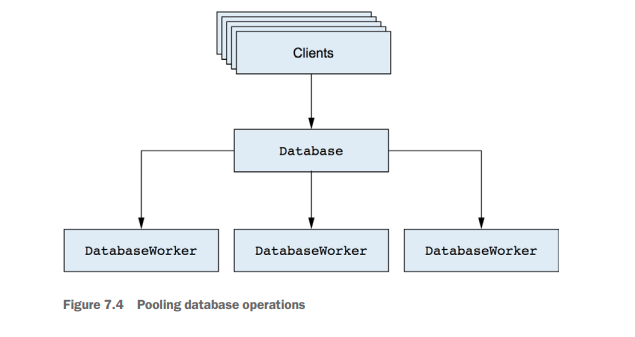
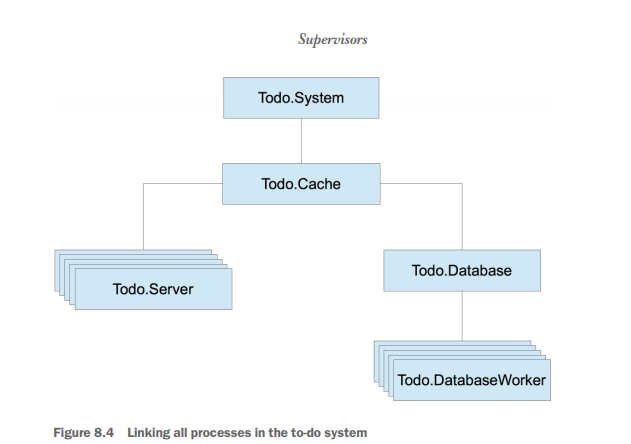

## Database connection pool


### How to run
```elixir
{:ok, cache} = Todo.Cache.start_link()
steve_list = Todo.Cache.server_process(cache, "steve_list")
Todo.Server.add_entry(steve_list, %{date: ~D[2022-02-19], title: "Practice violin"})
Todo.Server.entries(steve_list, ~D[2022-02-19])  
# => [%{date: ~D[2022-02-19], id: 1, title: "Practice violin"}]
```
If all goes well, there should be a file named persist/steve_list on the disk.


## Todo Supervisor


### How to run
```elixir
Todo.System.start_link()
jedi_list = Todo.Cache.server_process("jedis list")
Todo.Server.add_entry(jedis_list, %{date: ~D[2022-02-19], title: "Practice violin"})
...

:erlang.system_info(:process_count)
cache_pid = Process.whereis(Todo.Cache)
Process.exit(cache_pid, :kill)
```

See more information about `GenServer.start/3` vs `GenServer.start_link/3` 
https://hexdocs.pm/elixir/1.12/GenServer.html#start_link/3
